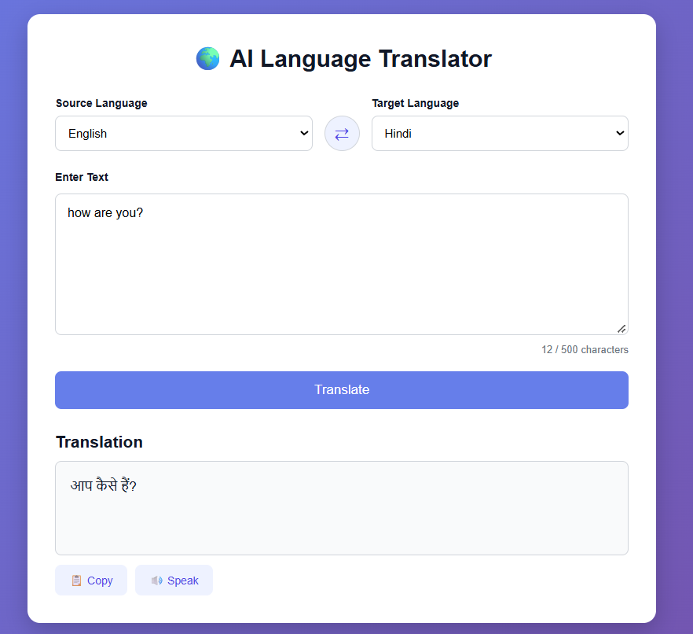

# AI Language Translator

## Project Description

This project is a web-based language translation tool developed as part of the CodeAlpha Internship.

The application allows users to enter text, select a source language and target language, and translate the text using LibreTranslate.

## Features

- Multiple language translation
- Source and target language selection
- Language swap option
- 500 character limit
- Copy translated text
- Text-to-speech
- Simple and responsive user interface

## Technologies Used

- HTML
- CSS
- JavaScript
- Python
- Flask
- LibreTranslate

## Project Structure

```text
CodeAlpha-Language-Translator/
│
├── app.py
├── requirements.txt
├── README.md
│
├── templates/
│   └── index.html
│
└── static/
    ├── style.css
    └── script.js
```

## How to Run

### Step 1: Create virtual environment

```bash
python -m venv venv
```

### Step 2: Activate virtual environment

```bash
venv\Scripts\activate
```

### Step 3: Install packages

```bash
pip install -r requirements.txt
```

### Step 4: Start LibreTranslate

```bash
libretranslate --port 5001
```

### Step 5: Start Flask

Open another terminal and run:

```bash
venv\Scripts\activate
python app.py
```

### Step 6: Open the application

```text
http://127.0.0.1:5000
```

## How It Works

User enters text → Selects languages → Flask sends the request to LibreTranslate → Translation is returned → Result is displayed on the webpage.

## Internship

CodeAlpha Internship

Task: Language Translation Tool

Domain: Artificial Intelligence and Natural Language Processing


## Screenshot

